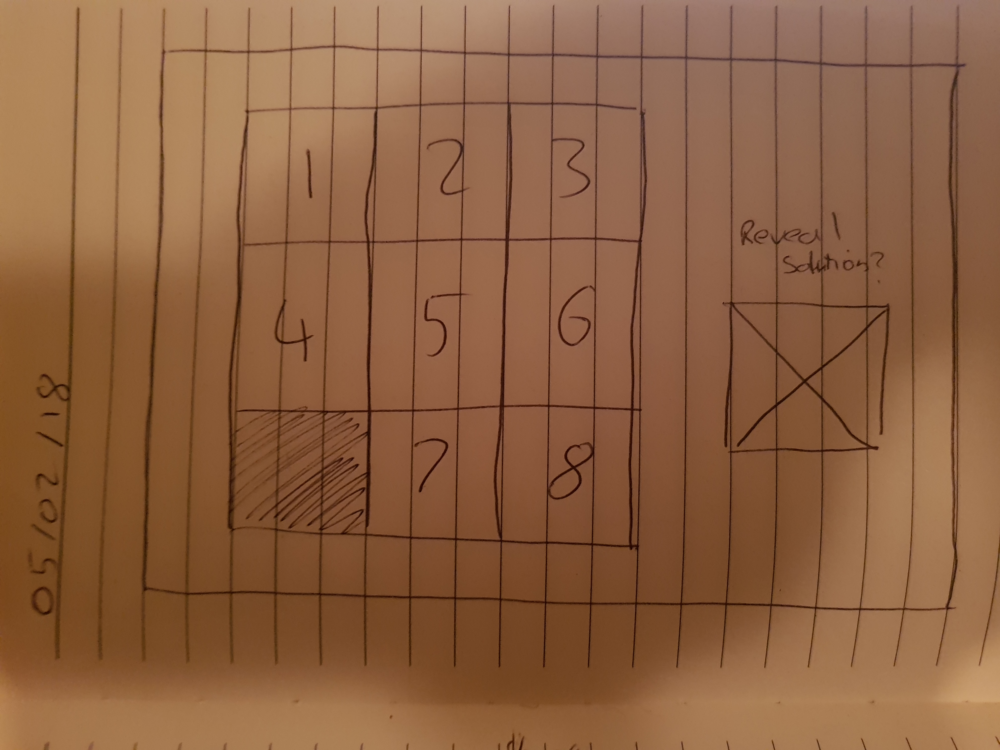

# Sparta-Core-Project-1
### Sliding Puzzle Game

---

#### Project Brief

For this project we have been tasked with creating a game that consolidates everything we have touched on in weeks 1 and 2 of our Sparta academy training.  This includes HTML5, CSS, Bootstrap, JavaScript and JQuery.

The game was to include instructions on how to play the game as well as notifying the player when they have won or lost whilst showing them the score that they achieved in doing so.  The game was to look nice in it's style and to be hosted online.

The game is currently hosted online at [NBurns90.gitgub.io][34391a31].

  [34391a31]: NBurns90.gitgub.io "Here"

---

#### How to play the Game

To play this game you can either visit the online hosted game which is at the location above or you can download the entire repository as a zip.  Once the folder has been downloaded you must unzip or extract it.  Once the folder has been extracted, open index.html in chrome and the game should appear on your screen.

---

#### Aim of the Game

This sliding puzzle game is based on the well known 15 puzzle.  The game is made up of individual squares which slide around inside a board.  There is one piece missing which allows the player to move only one piece at a time.  The aim of the game is to slide the pieces around until the picture has been completed.  For the purpose of this particular incarnation, you have your turns counted and a timer ticking along which is then used to calculate a score.  If the timer reaches zero you lose.

---

#### Agile Stages and Scope

This project was approached using an agile methodology.  It was broken up into different stages:

- **Stage 1**
  - Planning and Wireframing
  - User stories
  - Core functionality logic
  - Sprint 1

- **Stage 2**
  - Complete any features that did not make it into Sprint 1
  - New user stories for the next Sprint
  - Evaluate to-do list
  - Complete sprint 2

- **Stage3**
  - Test the game and make sure there isn't anything that breaks the game.
  - Make sure the game styling is on target
  - Get other people to test and play the game

---

#### Planning and Wireframing

Before I began on the computer I made a simple wireframe of how I wanted the page to be laid out.  Over time this evolved and the beginning wireframe ended up slightly different to the completed game.

#### User stories

To keep track of my user stories I used Trello.  Each user story was tracked and assigned a label based on how critical the task was.  If something evolved to be out of scope then I changed the label when required.  I also kept tabs on a to-do list that allowed me to focus on specific tasks as I was moving through development.

This is my Trello board as of current:

#### Sprint 1

For sprint 1 I aimed to get the core functionality implemented and meeting the MVP (minimum viable product) before the sprint 1 deadline.  I hit most of the targets but I lacked on a couple of the features.  The incomplete features were then completed for the beginning of sprint 2.

#### Sprint 2

For sprint 2 I aimed to finish up everything that was incomplete for sprint 1.  After the features were completed I moved on with finishing the features I had laid out for sprint 2.  Sprint 2 consisted mainly of theming and style as well as modal functionality.  This sprint was the final sprint to get the most out of the game as possible.

There are further features that could have been added if there was a third sprint, however prioritising the user requirements and core functionality was of paramount importance to meeting the functionality requirement of the game whilst looking nice at the same time.

---

#### Conclusion

Overall this game has allowed me to put into work everything I have learned over the past 2 weeks.  The process of Agile has also allowed me to improve how I had manage my time and manage projects.  Overall this project has taught me new ways to approach problems and new, effective way on how to research quickly and to understand how put into practice other peoples ideas in a context of my own.

---
